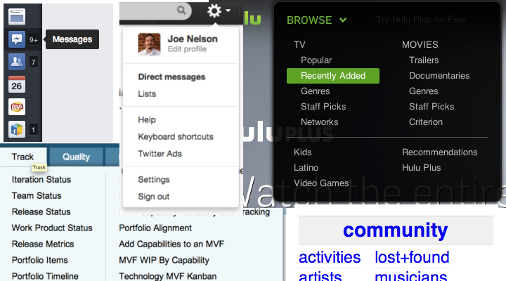
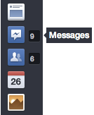
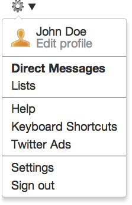

### A new vocabulary for the front-end



**Look at the menus.** What do you see? I don't see `div` and `li` and
`dl`, I see *groups* and *items* and *descriptions* and *selections.* So
let's just use markup that says what we mean.

### Abstracted from Real Sites

The markup in this project comes from experiments replicating parts of
real sites. The challenge is to collect a wide assortment of screenshots
of actual page items, like menus, then invent one piece of clean markup
that can be styled to look like any of them.

### Translated by AngularJS


```html
<menu>
  <item id="news"     text="News Feed"     selected="true" />
  <item id="messages" text="Messages"      description="9" />
  <item id="friends"  text="Find Friends"  description="6" />
  <item id="events"   text="Events"                        />
  <item id="photos"   text="Photos"                        />
</menu>

```


```html
<menu>
  <item id="gear" description="settings and help">
    <group>
      <item id="profile" url="#" text="John Doe" description="Edit Profile" />
    </group>

    <group>
      <item url="#" text="Direct Messages" selected=true />
      <item url="#" text="Lists" />
    </group>

    <group>
      <item url="#" text="Help" />
      <item url="#" text="Keyboard Shortcuts" />
      <item url="#" text="Twitter Ads" />
    </group>

    <group>
      <item url="#" text="Settings" />
      <item url="#" text="Sign out" />
    </group>
  </item>
</menu>
```

### Interactive Demo

The showpiece
[playground](http://begriffs.github.io/showpiece/playground) uses an
old-fashioend JSON template language to generate the markup. It is a
good place to experiment with creating a new widget style. We're porting
this approach to AngularJS. It dynamically loads templates, examples,
and styles from this repo and provides quick feedback.

### Contributing

So far this project includes a template for menus, but it still needs
templates for every other kind of common web widget To name a few:
breadcrumbs, forms, and pagination links.

You can also improve existing templates. Here's how. Take a screenshot
of a widget on a real site. Let's say it's a menu on www.foo.com. And
the screenshot to `wild/menus/foo.png`. Now try to define the showpiece
structure of the menu and save it in `templates/menu/examples/foo.json`.
Finally try to style the markup that showpiece generates and save your
style to `templates/menu/styles/foo.css`. If the markup isn't flexible
enough to let you style the widget correctly then submit an issue to
this repo.

### License

Showpiece is Copyright © 2013 Joe Nelson. It is free software, and may
be redistributed under the terms specified in the LICENSE file.
